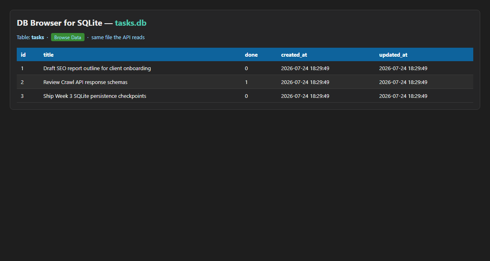

# Task API · SQLite — FlyRank W3 · A2

Week 2 gave you CRUD doors. Week 3 keeps those doors and moves the shelf from **RAM → SQLite**.

```
Assignment 1:  Client → API → list in memory
This one:      Client → API → tasks.db (SQLite file)
```

Clients still send the same requests. After a restart, the data is still there.

## Why SQLite?

SQLite is a **single-file, zero-setup** database — no separate server to install. Perfect for local APIs and demos: open `tasks.db`, and you are looking at the same source of truth the API uses. When the project outgrows one file, the routes stay; only the storage layer changes again (Postgres, etc.).

## Run (one command)

```bash
pip install -r requirements.txt && uvicorn main:app --reload --port 8000
```

On first start the app:

1. Creates `tasks.db` if missing  
2. Creates the `tasks` table if missing  
3. Seeds **three** example tasks **only when the table is empty**

`tasks.db` is **git-ignored** so every clone starts fresh and clean.

- API: http://localhost:8000/  
- Swagger: http://localhost:8000/docs  

## Endpoints (same shapes as A1)

| Method | Path | Status | Storage |
|--------|------|--------|---------|
| GET | `/` | 200 | meta |
| GET | `/health` | 200 | meta |
| GET | `/tasks` | 200 | `SELECT` (+ optional `?done=` `?search=` `?sort=true`) |
| GET | `/tasks/{id}` | 200 / 404 | parameterized `SELECT` |
| POST | `/tasks` | 201 / 400 | parameterized `INSERT` |
| PUT | `/tasks/{id}` | 200 / 400 / 404 | parameterized `UPDATE` |
| DELETE | `/tasks/{id}` | 204 / 404 | parameterized `DELETE` |
| GET | `/stats` | 200 | `SELECT COUNT(*)` |

404 body: `{"error":"Task not found"}`

## Persistence proof

Created a task, stopped the server, started it again — `GET /tasks` still returned it. That is the whole point of a database.

Identical A1-style curls still pass against this SQLite version. That is the proof that **storage is an implementation detail**: the API promise did not change.

## Example SQL (Stage 4)

```sql
SELECT * FROM tasks WHERE done = 1;
```

Returned the completed seed row(s) from `tasks.db`. Then `GET /tasks?done=true` showed the same rows through the API — no sync step; one file.

Full notes: [`docs/sql-exploration.md`](docs/sql-exploration.md)

## Database screenshot

Browse Data view of `tasks.db` (table `tasks`):



Open the same file locally with [DB Browser for SQLite](https://sqlitebrowser.org/) if you want the desktop app.

## Schema notes (timestamps)

Added `created_at` / `updated_at` after the first table existed. Changing a live table’s shape felt fiddly (PRAGMA + `ALTER TABLE`) — that discomfort is exactly why later weeks teach **migrations**: written, repeatable schema changes instead of one-off alters.

An **index** on `title` (`idx_tasks_title`) speeds search (`LIKE`). An index is a sorted lookup helper so the database does not scan every row for common filters.

Seeding uses a **transaction** so the three example inserts are all-or-nothing — you never get a half-seeded demo table.

## Project layout

```
main.py              # FastAPI routes (the doors)
database.py          # SQLite storage layer (the shelf)
requirements.txt
docs/sql-exploration.md
assets/db-browser.png
ai-version/          # Stage 6 quarantine
```

## AI vs me (Stage 6)

### Prompt v1

See [`ai-version/PROMPT_v1.md`](ai-version/PROMPT_v1.md). First output: [`ai-version/main.py`](ai-version/main.py).

**What the AI did better:** compact single-file wiring and immediate `setup()` — easy to read at a glance.

**What it got wrong:**

1. **Seed multiplies** — inserts three rows on every import/startup (no `COUNT(*)` guard).  
2. **String-glued SQL** — `f"… WHERE id = {task_id}"` instead of `?` parameters.  
3. **Error shape** — `HTTPException(detail=…)` → `{"detail":…}` instead of `{"error":"Task not found"}`.

**What my prompt forgot:** I did not scream “seed only when empty” loudly enough, nor ban f-string SQL, nor require the top-level `error` key.

### Rematch (v2)

Improved prompt: [`ai-version/PROMPT_v2.md`](ai-version/PROMPT_v2.md) → [`ai-version/main_v2.py`](ai-version/main_v2.py).  

**What changed:** spelling out “COUNT before seed”, “never f-strings”, and exact 404 JSON made the rematch stop duplicating seeds and use parameterized queries.

```bash
git diff --no-index database.py ai-version/main.py
git diff --no-index database.py ai-version/main_v2.py
```

## Commits

- Stage 0: create SQLite database  
- Stage 1: database read endpoints  
- Stage 2: insert into database  
- Stage 3: update and delete with SQL  
- Stage 4: explored SQLite  
- Extras: SQL search, filter, sort, stats, timestamps, index, seed transaction  
- Stage 5: database documentation  
- Stage 6: AI vs me  

## License

MIT — FlyRank Backend internship, Week 3.
